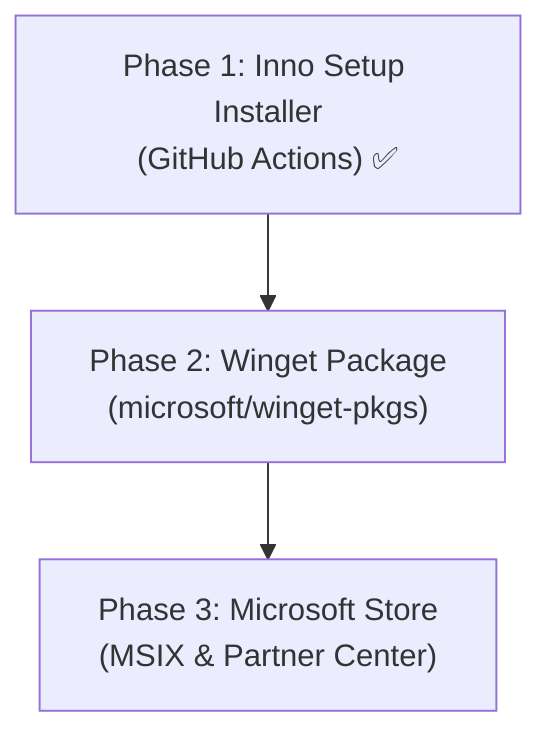

# Distribution & Publishing Plan for dotXPANDER

This document describes the strategy, requirements, and step-by-step roadmap for distributing and publishing **dotXPANDER** to Windows users.

---

## 1. Distribution Channels

| Channel | Purpose / Audience | Requirements | Cost | Priority |
| :--- | :--- | :--- | :--- | :--- |
| **GitHub Release (Inno Setup)** | Classic setup file with Start Menu shortcut, autostart, and clean uninstallation. | Inno Setup script (`.iss`) in repo + GitHub Actions integration. | Free | **Phase 1 (Highest) ✅ Done** |
| **Winget (Windows Package Manager)** | Easy CLI installation (`winget install dotXPANDER`) for technical users. | GitHub Release download URLs + PR to `microsoft/winget-pkgs`. | Free | **Phase 2 (High)** |
| **Microsoft Store** | Graphical store, broad distribution, automatic signing & updates without SmartScreen warnings. | Microsoft Partner Center account + MSIX packaging + Store certificate/approval. | ~$19 one-time fee | **Phase 3 (Medium)** |

---

## 2. Architecture Handling: ARM64 vs. x86_64

The app is built for both native ARM64 (e.g. Snapdragon X Elite/Plus) and traditional 64-bit Intel/AMD (x86_64).

- **GitHub Releases:** Builds two setup files: `dotXPANDER-Setup-arm64.exe` and `dotXPANDER-Setup-x64.exe`. Also ships standalone portable ZIPs.
- **Winget:** Supports multi-architecture in a single manifest. Winget automatically detects the client's CPU architecture and downloads the matching native installer.
- **Microsoft Store:** Multiple MSIX packages (or a `.msixbundle`) uploaded under the same submission. The Store automatically serves the correct package to the user.

---

## 3. Roadmap

---

## Phase 1: Inno Setup Installer & GitHub Actions ✅ Complete

**Goal:** Give users a standard Windows installation experience with uninstallation, autostart, and cloud-synced config support.

### What was implemented

**`installer/setup.iss`** — Full Inno Setup script:
- Per-user installation to `{localappdata}\Programs\aiVOLUTION\dotXPANDER` — no UAC prompt required.
- Start Menu shortcut created automatically.
- Optional Desktop shortcut (unchecked by default).
- Optional autostart at Windows login via `HKCU\Software\Microsoft\Windows\CurrentVersion\Run` (checked by default).
- Registered in *Windows Settings → Apps → Installed apps* for clean uninstallation.
- **Custom wizard page** — asks the user where to store `config.toml` before installation completes. Default: `%APPDATA%\aiVOLUTION\dotXPANDER`. Includes a hint to pick a cloud-synced folder (OneDrive, Dropbox, etc.) to share snippets across multiple computers.
- Chosen config directory written to registry: `HKCU\Software\aiVOLUTION\dotXPANDER\ConfigPath`.
- **Smart uninstall logic** — only deletes config files if they are in the default `%APPDATA%\aiVOLUTION\dotXPANDER` location. Custom/cloud-synced paths are left intact.
- Default `config.toml` written to the chosen location on install, but only if one does not already exist (preserves existing snippets from another machine).

**`ui/icon.ico`** — Application icon converted from `ui/icon.png` for use in installer and executable.
**`installer/wizard_small.bmp`** — Branded 55×58 header logo for Inno Setup wizard pages (`WizardSmallImageFile`).
**`installer/wizard_large.bmp`** — Branded 164×314 sidebar banner for Welcome and Finish wizard pages (`WizardImageFile`).

**`.github/workflows/release.yml`** — Updated CI/CD pipeline:
- Builds release binaries with Rust Nightly + `build-std` (`-Z build-std=std,panic_abort`) across both `arm64` and `x64`.
- Compresses x64 binary with UPX (`upx --best --lzma`) down to ~3.3 MB (ARM64 remains native as UPX does not support Windows ARM64 PE).
- Runs `iscc` (Inno Setup Compiler) for both `arm64` and `x64` builds.
- Uploads `dotXPANDER-Setup-arm64.exe` and `dotXPANDER-Setup-x64.exe` to GitHub Releases alongside portable ZIPs and SHA-256 checksums.

**Binary Size & Link-Time Optimizations (B1 & B2)**:
- **`build-std` (B1)**: Recompiles `core`, `alloc`, and `std` from source with release profile flags (`opt-level = "z"`, `strip = true`, `panic = "abort"`), stripping unused standard library code on all architectures.
- **MSVC Linker Flags**: Enabled `/OPT:REF` (dead code elimination), `/OPT:ICF` (COMDAT folding), and `/FILEALIGN:512` (512-byte section alignment) in `.cargo/config.toml`.
- **UPX Compression (B2)**: Tested and integrated for x64 release packaging, dropping binary size by ~58% (from 7.77 MB down to 3.28 MB).
- **`scripts/build-release.ps1`**: Standalone helper script for one-command local release building with toolchain checks, `build-std`, and conditional UPX packing.

**`Cargo.toml`** — Added `Win32_System_Registry` feature to the `windows` crate, required for the upcoming config location feature in Rust code.

### Implemented (Phase 1 Follow-up) ✅ Complete

The following runtime and UI features designed as part of Phase 1 are fully implemented in Rust/Slint:

- **`src/config.rs`** — Registry-based config discovery (`resolve_config_dir`, `is_portable`, `move_config_dir`, `update_config_registry`). Reads `HKCU\Software\aiVOLUTION\dotXPANDER\ConfigPath` from the registry with automatic fallback to portable mode (config next to executable) or default `%APPDATA%\aiVOLUTION\dotXPANDER`.
- **`src/ui.rs`** — `move-config-folder` callback and `is-portable` property binding.
- **`ui/main.slint`** — Mode badge ("📦 Portable" / "💿 Installed") and "Move Config File…" button on the General tab.

---

## Phase 2: Winget Distribution

**Goal:** Enable installation and updates via `winget install dotXPANDER`.

1. **Requirements:**
   - Code signing: not required for Winget (hashes and sandboxed scanning are used).
   - Silent install flag: Inno Setup supports standard `/VERYSILENT /NORESTART /ALLUSERS=0`.
2. **Create manifest:**
   - Run `wingetcreate new <release-installer-URL>` to generate the YAML manifest.
   - Specify URLs for both `arm64` and `x64`.
   - Submit Pull Request to [microsoft/winget-pkgs](https://github.com/microsoft/winget-pkgs).
3. **Automation (optional):**
   - Add a GitHub Action (`vedantmgoyal2009/winget-releaser` or `winget-create`) that automatically opens a PR to the Winget repo on each new release.

---

## Phase 3: Microsoft Store (MSIX Distribution)

**Goal:** Maximum credibility, zero SmartScreen warnings, and automatic background updates.

1. **Prerequisites:**
   - Create an individual developer account at [Microsoft Partner Center](https://partner.microsoft.com/) ($19 one-time fee).
   - Prepare links to the GitHub repository and a Privacy Policy in README.
2. **MSIX Packaging:**
   - Set up MSIX packaging (e.g. via Windows SDK `MakeAppx` or `cargo-dist`).
   - Define app manifest (`AppxManifest.xml`) with icons, app name, and capabilities.
3. **Store Submission:**
   - Reserve app name in Partner Center.
   - Upload ARM64 and x64 MSIX packages.
   - Fill in store listing (description, screenshots, categories: Productivity / Accessibility).
   - Submit for certification (typically takes 24–48 hours).
